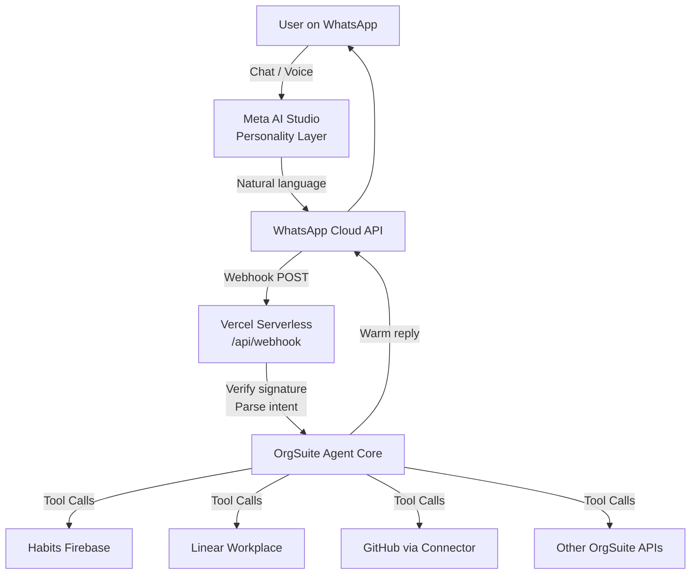

# OrgSuite Meta AI Agent

**Powerful cross-platform intelligent agent for WhatsApp + Vercel.**  
Secure tool-calling bridge that lets your Meta AI on WhatsApp control and query the full OrgSuite ecosystem (habits, Linear workplace, GitHub, home services, Vercel deployments, and more).

> **Linked Meta AI**: [https://wa.me/ais/867051314767696?s=5](https://wa.me/ais/867051314767696?s=5)  
> Make this AI *wonderful* by pairing Meta AI Studio personality with a real Vercel backend that can actually *do things*.

---

## Status

| Layer | Status | Notes |
|-------|--------|-------|
| GitHub Repo | **Completed** | This repository |
| Meta AI Studio Personality | **Ready to Configure** | Exact prompt in `/prompts` |
| WhatsApp Cloud API Webhook | **Ready to Configure** | Vercel serverless handler |
| Tool Calling (OrgSuite actions) | **Proposed** | Secure HTTPS callables |
| Vercel Deployment | **Requires Authorization** | Link + env secrets |
| Production Security | **Designed** | Signature verification, least privilege, rate limits |

---

## Architecture (Best Design)



**Why this design is powerful and wonderful:**

- **Personality stays in Meta AI Studio** — beautiful, creative, on-brand responses and media.
- **Intelligence + Actions live on Vercel** — real tool calling, audit logs, secure secrets, multi-AI routing (Grok + ChatGPT).
- **Zero credential exposure** — all secrets in Vercel Environment Variables / Firebase Secret Manager.
- **Least privilege** — every tool has scoped permissions and input validation.
- **Observable** — structured logging, rate limiting, and Linear issue linkage for every significant action.
- **Mobile-first** — WhatsApp is the primary interface; Vercel powers the brain.

---

## Quick Start (Make the Linked AI Powerful)

### 1. Configure Meta AI Studio Personality (5 minutes)

1. Open WhatsApp → Meta AI → Discover AIs → Edit / Create.
2. Paste the exact content from [`prompts/meta-ai-studio-personality.md`](prompts/meta-ai-studio-personality.md).
3. Set avatar / branding to OrgSuite logo if desired.
4. Save. Your existing link `https://wa.me/ais/867051314767696?s=5` will use the upgraded personality.

### 2. Deploy the Vercel Backend (the real power)

```bash
# Clone
git clone https://github.com/pointgoddesscc-sketch/orgsuite-meta-ai-agent.git
cd orgsuite-meta-ai-agent

# Install (if using local)
npm install

# Link to Vercel (or push and import in dashboard)
npx vercel
```

Required Environment Variables (Vercel → Settings → Environment Variables):

| Variable | Purpose |
|----------|---------|
| `WHATSAPP_VERIFY_TOKEN` | Webhook verification challenge |
| `WHATSAPP_APP_SECRET` | Signature validation |
| `WHATSAPP_ACCESS_TOKEN` | Reply messages |
| `WHATSAPP_PHONE_NUMBER_ID` | Your Business number |
| `XAI_API_KEY` or `OPENAI_API_KEY` | Agent reasoning |
| `ORGSUITE_*` | Specific tool endpoints (habits, Linear, etc.) |

### 3. Point WhatsApp Cloud API Webhook

In Meta Developer Console → WhatsApp → Configuration:

- Callback URL: `https://your-vercel-project.vercel.app/api/webhook`
- Verify Token: same as `WHATSAPP_VERIFY_TOKEN`
- Subscribe to `messages`

---

## Repository Structure

```
orgsuite-meta-ai-agent/
├── README.md                          # This beautiful overview
├── prompts/
│   └── meta-ai-studio-personality.md  # Exact personality for the linked AI
├── api/
│   └── webhook.js                     # Production Vercel serverless handler
├── lib/
│   ├── agent.js                       # Core reasoning + tool orchestration
│   ├── tools.js                       # OrgSuite action tools
│   └── security.js                    # Signature verification, rate limits
├── docs/
│   ├── ARCHITECTURE.md
│   └── SECURITY.md
└── package.json
```

---

## Security Principles (Non-Negotiable)

- Always verify `X-Hub-Signature-256` on every webhook.
- Never log or return secrets.
- All external calls use short-lived tokens or service accounts with least privilege.
- Input validation + schema checks before any tool execution.
- Rate limiting per WhatsApp user ID.
- Audit every tool call into Linear / Firebase for OrgSuite visibility.

---

## Making Calls Across Platforms

Once the webhook is live, the agent can:

- Log habits → Firebase Cloud Functions
- Create / update Linear issues (PSE Management)
- Trigger GitHub Actions or read repo status
- Query Vercel deployment health
- Control home services via authenticated OrgSuite APIs
- Route complex reasoning to personal Grok or ChatGPT

All from a natural WhatsApp conversation with the Meta AI you already love.

---

## Next Actions (Execution Focused)

1. **Completed**: Repository created and initialized with best-design architecture.
2. **Ready to Configure**: Paste the personality prompt into Meta AI Studio for AI ID `867051314767696`.
3. **Requires Authorization**: Provide / confirm Vercel team + Meta WhatsApp Business credentials so the webhook can be deployed and verified.
4. **Proposed**: Full tool catalog (habits, Linear, GitHub status, home bots) once backend is authorized.

---

**OrgSuite Engineering & Business Intelligence Partner**  
This is the production-grade bridge that turns a beautiful Meta AI personality into a *powerful* cross-platform agent.

Push this further by authorizing the Vercel + WhatsApp Cloud API connection and we will wire the live tools next.
